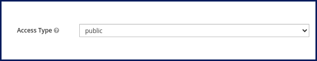

# Jitsi Keycloak Adapter v2

- [1. Features](#1-features)
- [2. Setup](#2-setup)
- [3. Keycloak configuration](#3-keycloak-configuration)
- [4. Similar projects](#4-similar-projects)
- [5. Sponsors](#5-sponsors)

Allow `Jitsi` to use `Keycloak` as an identity and `OIDC` provider. This is the
second generation of `jitsi-keycloak-adapter` designed for better integration
with Jitsi's built-in features such as `tokenAuthUrl`, `muc_wait_for_host`, etc.

See
[jitsi-keycloak-adapter-v1](https://github.com/nordeck/jitsi-keycloak-adapter)
for the initial design which is still actively maintained.

## 1. Features

- SSO for `Jitsi` through `Keycloak`. Allows `Jitsi` to run as an `OIDC`
  consumer.
- Better integration with Jitsi's built-in features for authentication flow.
- Allows `guest` users and `wait for host` screen if needed.

## 2. Setup

See [standalone setup](./docs/setup-standalone.md) guide to install it on a
standalone `Jitsi` server.

See [Docker setup](./docs/setup-docker.md) guide to integrate it with a
Dockerized `Jitsi` setup.

## 3. Keycloak configuration

Create `client` inside `realm`.

- Set `client id`
- Add `Jitsi` URL into `Valid redirect URIs`\
  e.g. `https://jitsi.mydomain.com/*`
- Add `Jitsi` URL into `Web origins`\
  e.g. `https://jitsi.mydomain.com` or just use `+`
- Set `Access type`
  - For Keycloak versions `< 20.x`, set `Access type` to `public`:

    

  - For Keycloak versions `>= 20.x`, disable `Client authentication`:

    
- Alternatively, set `Access type` to `confidential` (respectively, leave
  `Client authentication` enabled) and set the `KEYCLOAK_CLIENT_SECRET`
  environment variable to the client secret generated by Keycloak.

## 4. Similar projects

- [jitsi-keycloak-adapter-v1](https://github.com/nordeck/jitsi-keycloak-adapter)
- [jitsi-keycloak](https://github.com/D3473R/jitsi-keycloak)
- [Jitsi-SAML2JWT](https://github.com/Renater/Jitsi-SAML2JWT)
- [jitsi-OIDC-adapter](https://github.com/aadpM2hhdixoJm3u/jitsi-OIDC-adapter)
- [Jitsi Go OpenID](https://github.com/mod242/jitsi-go-openid)

## 5. Sponsors

